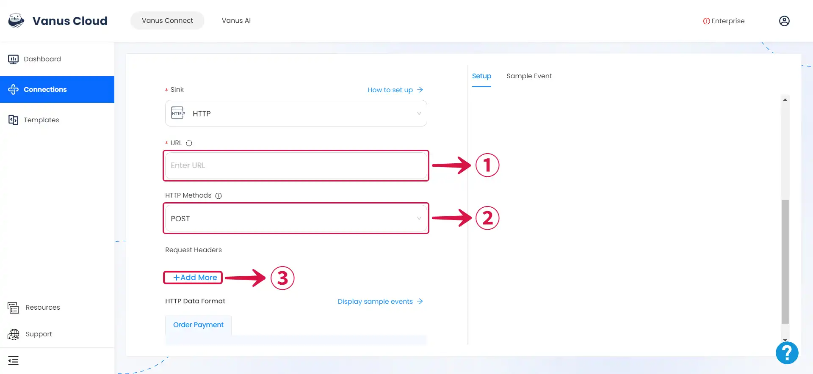
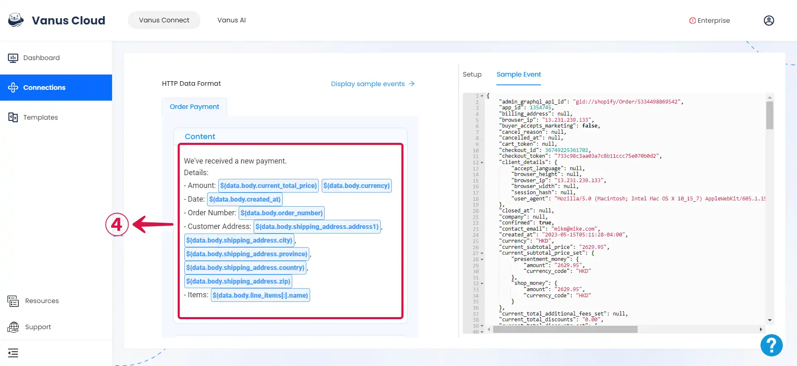
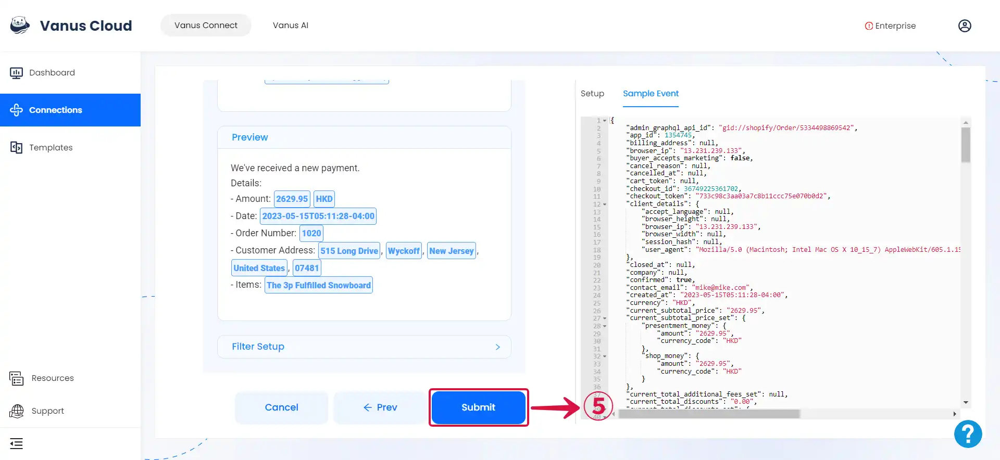

--- 
hide_table_of_contents: true
hide_title: true
---

### Prerequisites

- A [**Vanus Cloud Account**](https://cloud.vanus.ai).
- A payload URL.

---

**Perform the following steps to configure your HTTP Sink.**

### Step 1: HTTP Connection Settings

- Obtain a Payload URL from your application. This should be the EndPoint URL where you want to receive the HTTP requests.
- Paste the obtained payload URL into the **URL**① field.
- Choose the desired **HTTP Method**② (`POST`, `GET`, `PATCH`, `DELETE`, `PUT`).
- If needed, click on the **+Add More**③ button in the Request Headers section to add key-value pairs for custom headers.

---

### Step 2: Personalize Event Structure

:::note
This is a general instruction on how to personalize your event structure. You can structure your events to suit your specific requirements and create connections for different scenarios.
:::

1. Click on **Display sample events**① for reference, compose your preferred message, then type **`$` followed by the desired event**② to access a **list of associated event values**③, and choose the one you prefer.

2. You can structure the content as you prefer and fill in as many **values**④ as you wish to receive.

3. Click **Submit**⑤ to finish the configuration process.

---

Learn more about Vanus and Vanus Connect in our [**documentation**](https://docs.vanus.ai).
