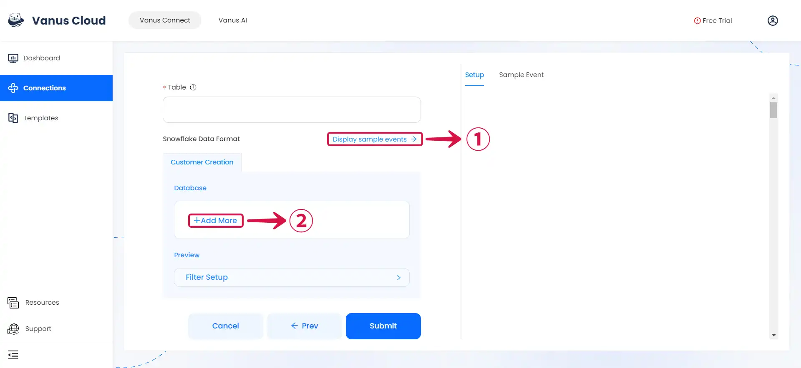
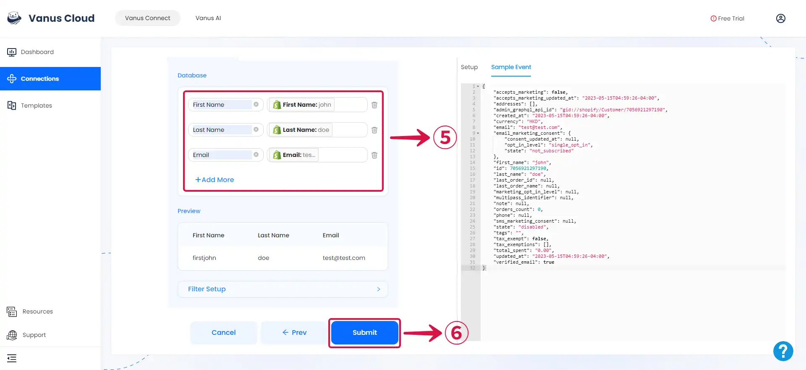

--- 
hide_table_of_contents: true
hide_title: true
---

### Prerequisites

- A [**Vanus Cloud Account**](https://cloud.vanus.ai).
- A [**Snowflake**](https://www.snowflake.com/) account with administrative privileges
- The user has either an `ACCOUNTADMIN` or `SECURITYADMIN` role in Snowflake.

---

**Perform the following steps to configure your Snowflake Source.**

:::note
If you have a Snowflake account already, you can skip Step 1 and directly go to [**Step 2**](#step-2-obtain-essential-snowflake-data).
:::

### Step 1: (Optional) Creating a Snowflake Account

When you sign up for an account on Snowflake, you'll receive 30 days of free access and $400 credits. However, any usage beyond this limit will be charged. The free trial begins once you complete the sign-up process and activate your account.

If you end up utilising all $400 credits before the 30-day trial period is over, your account will be suspended, and you won't be able to use any of its features. You can still log in to your account, but you won't be able to perform any actions, such as running a virtual warehouse, loading data, or running queries.

Let's get started:

1. Go to [**Snowflake Sign Up**](https://signup.snowflake.com/)

2. On the Sign Up page, provide the required **details**① and click **CONTINUE**②.

3. Select the **Snowflake edition**③ you want to use, choose your **cloud provider**④, select your preferred **region**⑤, agree to the **Snowflake Self Service On Demand Terms**⑥ and click **GET STARTED**⑦.

:::note
To make an informed choice that aligns with your organisation's requirements, Snowflake offers multiple editions and supported cloud platforms. Please explore the [**Snowflake Editions**](https://docs.snowflake.com/en/user-guide/intro-editions.html) documentation to understand the various edition options available. Additionally, for detailed pricing and specifics of each supported cloud platform, refer to the [**Supported Cloud Platforms documentation**](https://docs.snowflake.com/en/user-guide/intro-cloud-platforms.html).
:::

4. Click on **Skip**⑧ to continue your configuration.

5. An activation email from Snowflake has been sent to your registered email address. Click on **CLICK TO ACTIVATE**⑨ to activate your account.

6. Provide your preferred **Username**⑩ and **Password**⑪, **Confirm Password**⑫ and click **Get started**⑬.

---

### Step 2: Obtain Essential Snowflake Data

1. Get your account URL by going to **Admin**① and **Accounts**② from the side menu. Afterward, click on the **ellipsis icon**③.

2. Select **Manage Urls**④.

3. Click on the **chain-link icon**⑤ to copy the URL, and then click **Close**⑥.

4. Navigate to the **Worksheets**⑦ page.

5. Click on the **`+`⑧** button.

6. Select **SQL Worksheet**⑨.

7. Run the **`CREATE DATABSE my_db;`⑩** command to create a database named **MY_DB**⑪.

8. Click on the **ellipsis icon**⑫ and click **Refresh**⑬ to reflect the changes.

9. Take note of your **Role**⑭ and **Warehouse**⑮, and then execute the **`SHOW SCHEMAS;`⑯** command to identify the **active schema**⑰, which will be indicated by a **`Y`⑱** next to its name in the `is_current` field.

:::note
We utilized the default role, warehouse, and schema, but you have the option to create your own if you prefer.
:::

### Step 3: SnowFlake Connection Settings

1. Write the following information from the previous steps.

- **Account URL①**: This is the web address used to access and interact with your Snowflake data warehouse in the cloud.
- **Role②**: This is the Role name with the necessary privileges to perform operations on the Snowflake table.
- **Warehouse③**: This is the warehouse name that will execute queries for the Snowflake table.
- **Database④**: This is the name of the database that contains the Snowflake table.
- **Schema⑤**: This is the name of the schema that contains the Snowflake table.
- **Username⑥**: This is the username for your Snowflake account.
- **Password⑦**: This is the password for your Snowflake account.
- **Table⑧**: Generate a table by specifying the desired name for it, and the table will be set up with the required fields for your event.

### Step 4: Personalize Event Structure

:::note
This is a general instruction on how to personalize your event structure. You can structure your events to suit your specific requirements and create connections for different scenarios.
:::

1. Click on **Display sample events**① for reference and click on **Add More**② to add events.

2. **Input key**③ and search for the corresponding **value**④ for the event you want.

3. You can fill in as many **key-value pairs**⑤ as you wish to receive, and then click **Submit**⑥ to finish the configuration process.

---

Learn more about Vanus and Vanus Connect in our [**documentation**](https://docs.vanus.ai).
